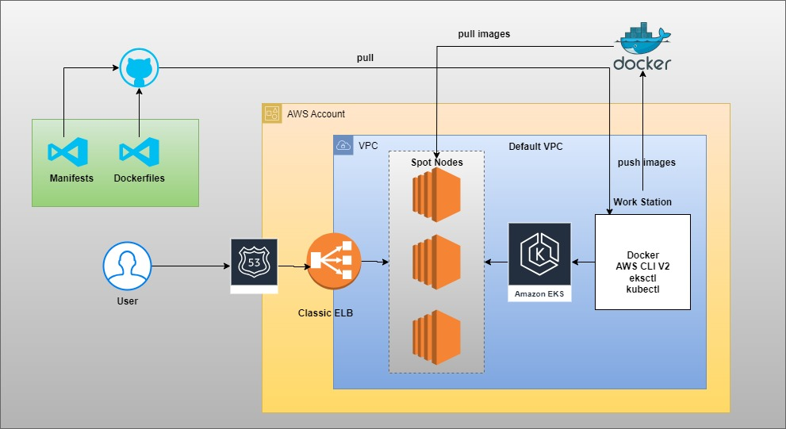

### Steps

**SSH-Keys**
* First prepare your SSH key pair.
* Import public key AWS key pairs.

**WorkStation**
* Create a security group that has all firewalls opened in Default VPC.
* Launch EC2 instance with AWS Linux 2 OS in Default VPC and allow-all SG.
* Install below packages in workstation.
    * Docker. https://raw.githubusercontent.com/techworldwithsiva/docker-install-commands/master/docker-install.sh
    * Git
    * AWS CLI V2. https://docs.aws.amazon.com/cli/latest/userguide/getting-started-install.html
    * Eksctl. https://github.com/eksctl-io/eksctl/blob/main/README.md#installation
    * kubectl. https://docs.aws.amazon.com/eks/latest/userguide/install-kubectl.html
* Once you ready the workstation, make sure you run aws configure.
* Fianlly create cluster

```
eksctl create cluster --config-file=eks.yaml
```

in AWS if one service wants to create or access other service. For example

* EKS cluster has to create Load Balancer. Then EKS cluster should have IAM Role that has a permission to create load balancer.
* Security Groups, when traffic is coming to EC2 instances, you should always check that port is allowed or not.

